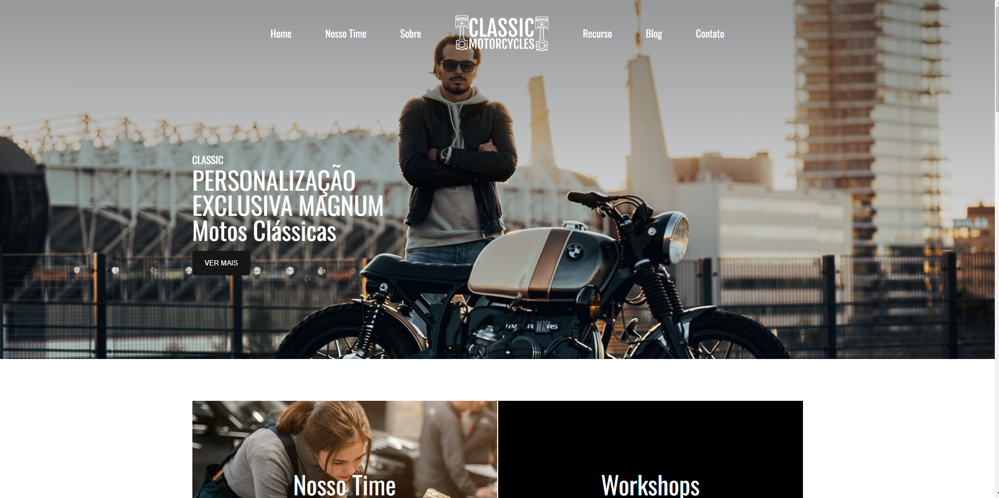

# Motos Clássicas

Um site dedicado aos entusiastas de motocicletas clássicas, oferecendo uma experiência imersiva sobre a paixão por motos vintage e a cultura que as cerca.

## Descrição do Projeto

O projeto "Motos Clássicas" é uma plataforma online que celebra as motocicletas clássicas e sua rica história. O site foi desenvolvido com HTML, CSS e JavaScript, apresentando uma interface moderna e responsiva. Os usuários podem explorar informações sobre nossa equipe, serviços, projetos personalizados, e acessar conteúdos relacionados ao mundo das motos clássicas.

## Estrutura do Projeto

O projeto é dividido em várias seções principais:

- **Header**: Contém a navegação principal e um destaque sobre a personalização de motos clássicas.
- **Equipe**: Informações sobre o time e serviços oferecidos.
- **Sobre**: Uma seção que descreve a filosofia da empresa e sua paixão por motos.
- **Recursos**: Um vídeo em destaque que captura a essência da experiência com motos clássicas.
- **Blog**: Artigos sobre motos clássicas, restauração e moda motociclística.
- **Instagram**: Galeria de fotos que mostra a comunidade e eventos relacionados.
- **Footer**: Informações de contato, redes sociais e opção de inscrição na newsletter.

## Tecnologias Utilizadas

- HTML
- CSS
- JavaScript
- Remix Icon (para ícones)

 
